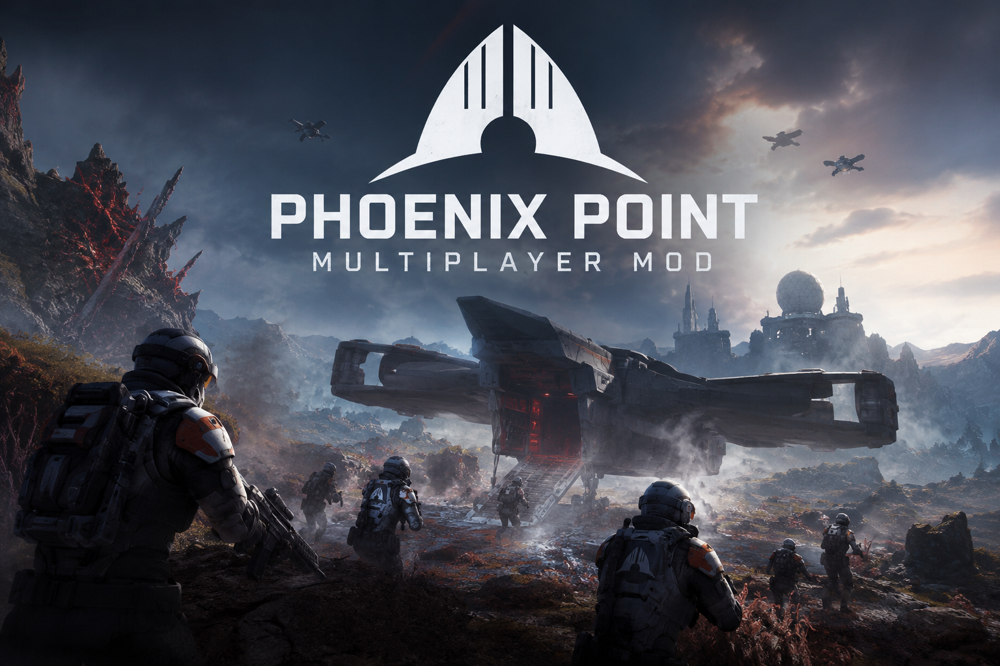

# Phoenix Point: Cooperative Multiplayer

[English](README.md) · [Русский](README.ru.md)

[](https://github.com/UberMorgott/PhoenixPoint-Mod-Multiplayer/releases/latest) [](https://github.com/UberMorgott/PhoenixPoint-Mod-Multiplayer/releases/latest) [](https://github.com/UberMorgott/PhoenixPoint-Mod-Multiplayer/stargazers) [](https://github.com/UberMorgott/PhoenixPoint-Mod-Multiplayer/issues/new) [](LICENSE)

Phoenix Point was never designed for multiplayer. This mod turns the entire campaign into a true cooperative experience where every player joins the same world, shares the same progress, and fights the same battles together.

Unlike "host watches, everyone else waits" designs, every player has equal control. Manage research, build bases, equip soldiers, launch aircraft, complete missions, or simply focus on your own squad. One active player can keep the campaign moving even if everyone else is away from the keyboard, because there are no mandatory confirmation prompts that stop the game.

## How it works

The multiplayer experience consists of three parts.

### Lobby

Players gather in a lobby before starting the campaign.

You can connect in three different ways:

- Steam friends / Steam invite
- STUN invite code
- Direct IP address or domain

Players can change their nickname and chat before the game starts.

When everyone is ready, the host selects a campaign save. The save is automatically transferred to every player, everyone loads it together, and the campaign continues from exactly the same point.

### Shared Geoscape

There is no "main player".

Every player can freely manage bases, research, manufacturing, aircraft, equipment and other campaign systems.

Story events are shared between everyone. If an event appears while you're busy managing soldiers or researching technology, it waits in a queue instead of interrupting what you're doing.

When one player chooses an event outcome, that choice immediately becomes the campaign's decision. Other players see the result but cannot select a different answer, keeping the campaign consistent without stopping everyone.

### Simultaneous Tactical Battles

The biggest gameplay change happens during tactical missions.

Normally Phoenix Point allows actions in any order during the player's turn. This mod extends that idea to multiplayer: every player can control soldiers at the same time.

Instead of waiting for one person to finish their turn, everyone can move, shoot, heal and use abilities simultaneously while it's the player's side's turn. It makes battles feel surprisingly fast even with several people playing together.

## Current limitations

- Beta software. Bugs are expected.
- Reconnecting after a disconnect is not implemented yet.
- TFTV is currently required, because the multiplayer code is tightly integrated with it.
- Although the networking architecture is designed to scale far beyond a typical co-op game, sessions with around 2 to 8 players are the intended experience.

## Requirements

- **Phoenix Point** and the game's built-in modding support. No external mod loader, no other dependencies.
- **TFTV (Terror from the Void) is required.** The multiplayer code is tightly integrated with it, so a session without TFTV is not supported. Get it here:
  - GitHub: https://github.com/Voland163/TFTV
  - Steam Workshop: https://steamcommunity.com/sharedfiles/filedetails/?id=2872311902
  - Discord: https://discord.gg/Ypt5p5trNx
- **All players need the same mods at the same versions and the same DLC entitlements.** A mismatch blocks the join.

You bring your own legally owned copy of Phoenix Point. This mod is built on Snapshot Games' official modding framework and ships no game code or assets. It is a fan project, not affiliated with, endorsed by, or supported by Snapshot Games.

## Install

Put the files here, inside your Phoenix Point install folder:

```
Phoenix Point/
└── Mods/
    └── Multiplayer/
        ├── Multiplayer.dll
        └── meta.json
```

Then enable **Multiplayer** in the game's mod list. A mod with this id already installed gets replaced: same id, same DLL name, same folder.

To play: one player hosts, which opens the lobby and starts listening on direct IP (port 14242 by default), STUN and Steam at once. The others join with an IP address, an invite code or a Steam invite. When everyone is ready, the host loads the campaign.

## Build from source

You need a .NET SDK that can target `net472` and a Phoenix Point install to reference: `ModSDK` for `0Harmony.dll`, `PhoenixPointWin64_Data/Managed` for `Assembly-CSharp.dll`, the Steamworks binding and the Unity modules.

```powershell
dotnet build Multiplayer.csproj -c Release
dotnet build Multiplayer.csproj -c Release -p:PhoenixPointDir="X:\path\to\Phoenix Point"
```

The install path is resolved in one place, `Directory.Build.props`, in this order: `-p:PhoenixPointDir` on the command line, then an environment variable of the same name, then the usual Steam and Epic locations.

`deploy.ps1` runs the same build and copies `Multiplayer.dll`, its `.pdb` and `meta.json` into `Mods/Multiplayer`; `-GameDir "X:\path\to\Phoenix Point"` overrides the lookup.

To run the law harness:

```powershell
cd tools/RailCheck
dotnet run -c Debug
```

It diffs against two committed files; `dotnet run -c Debug -- --update` rewrites both.

- `docs/rail-baseline.txt` — volatile: coverage table, husk lists, twin tables, known violations. Diff = expected growth, review and commit it.
- `docs/rail-contract.txt` — frozen: roots in walk order, codec mode, def-ownership caveat. Diff = `RAILCHECK RED (contract drift)`, an architectural promise changed.

That harness needs the game. The source-level check does not — it runs anywhere, including CI:

```powershell
pwsh -File tools/law-integrity.ps1
```

To run both on every commit, once per clone: `git config core.hooksPath .githooks`. The hook blocks on `law-integrity.ps1`, then runs RailCheck if a Phoenix Point install is resolvable and says loudly when it is not.

## Reporting a bug

[Open an issue](https://github.com/UberMorgott/PhoenixPoint-Mod-Multiplayer/issues/new/choose). The form asks for three things only: where it happened, what happened, and how to reproduce it. Everything else is optional, but a log and a save turn a guess into a fix.

The mod writes its own log to `%USERPROFILE%\AppData\LocalLow\Snapshot Games Inc\Phoenix Point\Multiplayer\multiplayer.log`, rotated to `multiplayer-prev.log` on the next launch. Attach it from every player if you can: most sync bugs are only visible when the host's log and a client's log are read side by side.

## Architecture

The technical deep dive lives in [`ARCHITECTURE.md`](ARCHITECTURE.md), [`docs/rail-contract.txt`](docs/rail-contract.txt) and [`docs/rail-baseline.txt`](docs/rail-baseline.txt).

## License

Noncommercial. Free to use, study and build on, with attribution; not for sale. Terms: [Creative Commons Attribution-NonCommercial 4.0 International](LICENSE) (CC BY-NC 4.0).
